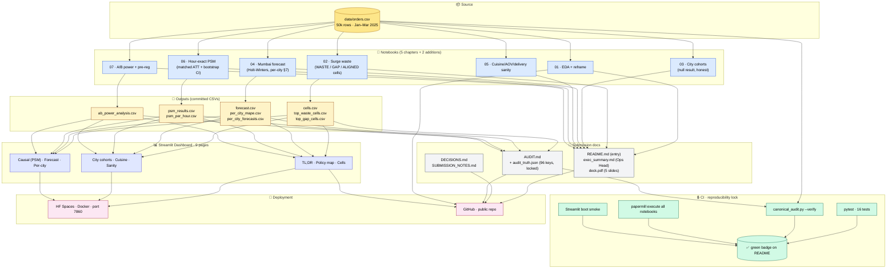

# Architecture

A picture of how the moving parts connect, what gets persisted where, and which pipeline keeps the analysis honest.

## End-to-end flow

## What each layer guarantees

**Source.** The 50k-row dataset is the single source of truth. Nothing else is ground.

**Notebooks.** Five plus two. Each is a self-contained chapter of the investigation. Every notebook builds figures inline (no external chart dependencies) and writes its primary findings to CSV in `outputs/`. Notebooks can be run in any order; they read the source CSV directly.

**Outputs.** Eight CSV files. These are the *contracted handoffs* between notebooks and downstream consumers — the docs reference them, the dashboard renders them, the audit reads them. Pinning them as files (not in-memory frames) lets the dashboard run without re-executing notebooks.

**Dashboard.** Nine pages, organised into three thematic groups. The dashboard reads from `data/` and `outputs/`, never re-derives findings — the goal is responsive interactivity, not duplicate computation.

**Docs.** Six markdown files. Each has a job. README is the entry; exec_summary is the Ops Head deliverable; DECISIONS/AUDIT/SUBMISSION_NOTES document the rigour.

**CI · reproducibility lock.** Four checks. Together they guarantee that no commit can drift a number, break a notebook, or ship a dashboard that doesn't boot.

**Deployment.** Two endpoints. HF Spaces serves the live dashboard via Docker on port 7860. GitHub serves the public source.

## The data contract

The notebooks expect `data/orders.csv` to satisfy these properties (asserted by `tests/test_data_quality.py`):

| Property | Value |
|---|---|
| Rows | exactly 50,000 |
| Date range | 2025-01-01 → 2025-03-31 |
| Cities | exactly 7: {Bangalore, Chennai, Delhi, Hyderabad, Kolkata, Mumbai, Pune} |
| Cuisines | exactly 9 |
| Restaurants | exactly 800 |
| Nulls | zero across all columns |
| Duplicate `order_id` | zero |
| Surge rate | within [23.4%, 24.4%] |
| Columns | `[order_id, timestamp, city, restaurant_id, cuisine, order_value, delivery_time_min, surge_applied]` |

If any of these fail, CI fails before the analysis even runs. The data contract is the foundation; everything else assumes it.

## The audit lock

`audit_truth.json` contains 96 key/value pairs covering every number quoted anywhere in the submission. The `scripts/canonical_audit.py --verify` mode recomputes all 96 from raw data and asserts they match — bit-exactly for integers, within tolerance for bootstrap CIs.

Any change to a notebook or a script that materially shifts a number breaks the build. To intentionally update a number: rerun `--write` to regenerate the lock, then commit both the lock and the change in the same PR. The reviewer sees both the intent and the impact.

This is what gives `AUDIT.md` its teeth.
